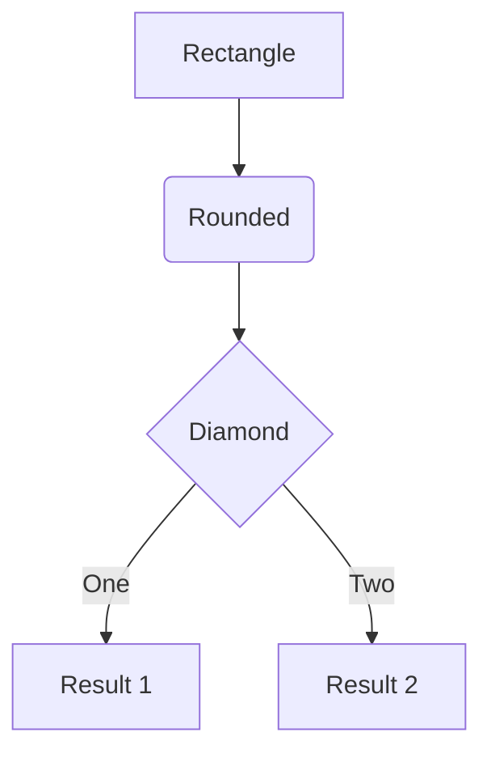
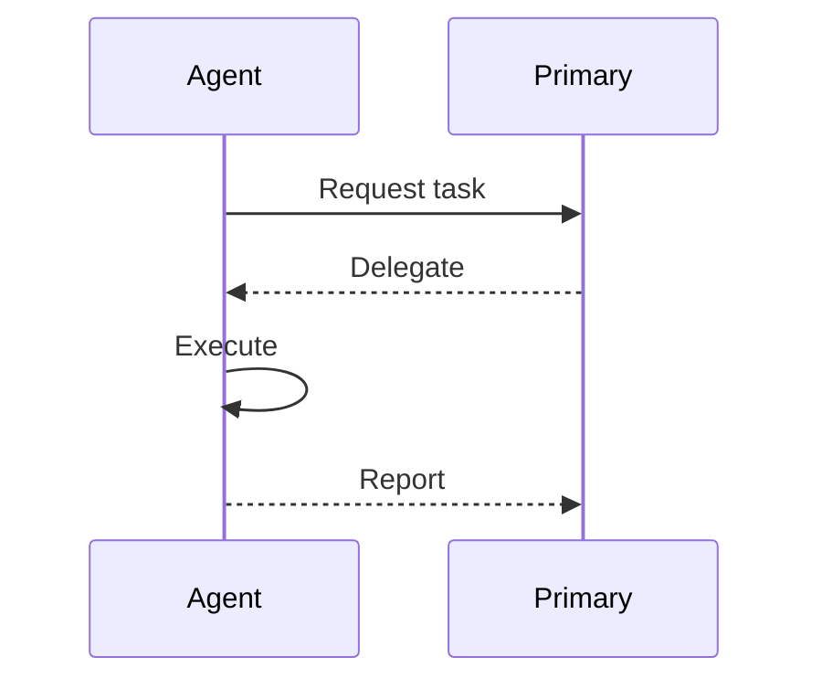
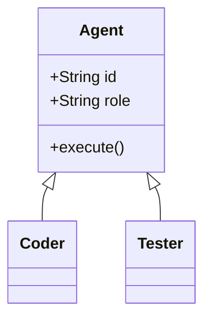
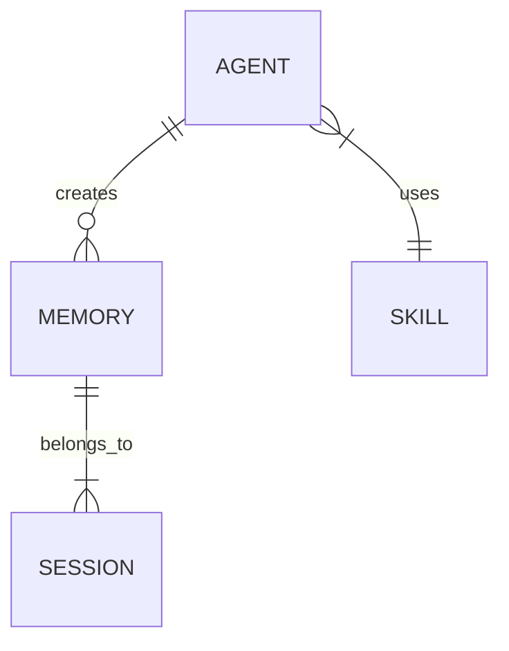

# Diagram Generator Skill

**Generate diagrams from Mermaid code using free Kroki API - no authentication required.**

**Complementary to WEAVER's image-generation skill:** This handles technical diagrams (architecture, flowcharts, sequences), while image-generation handles artistic visuals (blog headers, graphics).

## Purpose

Enable agents to create professional diagrams programmatically from Mermaid syntax, saving PNG files locally for use in documentation, blogs, and architectural records.

---

## Quick Start

```python
from tools.diagrams.kroki import generate_diagram

# Generate a flowchart
mermaid_code = """
flowchart TD
    A[Start] --> B{Decision}
    B -->|Yes| C[Action 1]
    B -->|No| D[Action 2]
    C --> E[End]
    D --> E
"""

output_path = generate_diagram(mermaid_code, "/tmp/flowchart.png")
print(f"Diagram saved to: {output_path}")
```

---

## Kroki API Details

**Endpoint:** `https://kroki.io/{diagram_type}/{output_format}/{encoded_payload}`

**Cost:** FREE - No API key required!

**Supported Diagram Types:**
| Type | Keyword | Best For | Formats |
|------|---------|----------|---------|
| Mermaid | `mermaid` | Flowcharts, sequences, class diagrams | png, svg |
| PlantUML | `plantuml` | UML diagrams, complex sequences | png, svg, pdf |
| GraphViz | `graphviz` | Network graphs, dependencies | png, svg, pdf |
| D2 | `d2` | Modern diagrams with icons | svg only |
| Structurizr | `structurizr` | C4 architecture diagrams | svg only |
| Ditaa | `ditaa` | ASCII art to diagrams | png, svg |
| ERD | `erd` | Entity-relationship diagrams | png, svg |
| Nomnoml | `nomnoml` | UML class diagrams | svg only |

**Output Formats:** Varies by type (see table above). Default to PNG for Mermaid/PlantUML/GraphViz.

**⚠️ WEAVER TESTING NOTE (2025-12-30):** Format support is diagram-type dependent. Original docs claimed universal PNG/SVG/PDF - tested and corrected.

**Encoding Method:**
1. Compress with zlib (level 9)
2. Base64 URL-safe encode
3. Append to URL

---

## Python Helper Module

**Location:** `tools/diagrams/kroki.py` (copy from this skill's kroki.py)

### Core Function

```python
import base64
import zlib
from pathlib import Path
import urllib.request

def generate_diagram(
    diagram_code: str,
    output_path: str,
    diagram_type: str = "mermaid",
    output_format: str = "png"
) -> str:
    """
    Generate a diagram using Kroki API.

    Args:
        diagram_code: Mermaid/PlantUML/etc code
        output_path: Where to save the output file
        diagram_type: One of mermaid, plantuml, graphviz, d2, structurizr
        output_format: One of png, svg, pdf

    Returns:
        Absolute path to saved file

    Raises:
        DiagramError: If Kroki API fails or file cannot be written
    """
    # Compress and encode the diagram code
    compressed = zlib.compress(diagram_code.encode('utf-8'), 9)
    encoded = base64.urlsafe_b64encode(compressed).decode('ascii')

    # Build URL
    url = f"https://kroki.io/{diagram_type}/{output_format}/{encoded}"

    # Fetch diagram
    with urllib.request.urlopen(url, timeout=30) as response:
        content = response.read()

    # Save to file
    output = Path(output_path)
    output.parent.mkdir(parents=True, exist_ok=True)
    output.write_bytes(content)

    return str(output.absolute())
```

---

## Mermaid Syntax Reference

### Flowchart



### Sequence Diagram



### Class Diagram



### Entity-Relationship



---

## Usage Examples

### Architecture Diagram

```python
arch_diagram = """
flowchart TB
    subgraph Primary
        P[Primary AI]
    end
    subgraph Agents
        C[Coder]
        T[Tester]
        R[Reviewer]
    end
    subgraph Memory
        M[(memories/)]
    end
    P --> C
    P --> T
    P --> R
    C --> M
    T --> M
    R --> M
"""

generate_diagram(arch_diagram, "exports/architecture.png")
```

### Agent Delegation Flow

```python
delegation_flow = """
sequenceDiagram
    actor Corey
    participant Primary
    participant Coder
    participant Tester

    Corey->>Primary: Task request
    Primary->>Coder: Delegate implementation
    Coder-->>Primary: Code complete
    Primary->>Tester: Delegate testing
    Tester-->>Primary: Tests pass
    Primary-->>Corey: Task complete
"""

generate_diagram(delegation_flow, "exports/delegation-flow.png")
```

---

## Error Handling

```python
try:
    path = generate_diagram(code, output)
    print(f"Success: {path}")
except DiagramError as e:
    if "syntax" in str(e).lower():
        print("Invalid diagram syntax - check Mermaid code")
    else:
        print(f"Kroki API error: {e}")
except IOError as e:
    print(f"File write error: {e}")
```

---

## Anti-Patterns

| Anti-Pattern | Correct Approach |
|--------------|------------------|
| Using raw API without compression | Always compress + base64 encode |
| Hardcoding output paths | Use `exports/` or `memories/` directories |
| Not handling API errors | Wrap in try/except with specific handling |
| Generating without verification | Use Read tool to view the PNG after generation |

---

## Success Indicators

You're using this skill correctly when:
- [ ] Diagram code validates (no syntax errors)
- [ ] PNG file exists at expected path
- [ ] File size is reasonable (>1KB for valid diagrams)
- [ ] Diagram visually matches intent (verify with Read tool)

---

## Integration Notes

**Default Output Directory:** `exports/diagrams/`

**Naming Convention:** `{context}-{type}-{date}.png`
- Example: `agent-delegation-flowchart-20251230.png`

**For Blog Posts:** Save to website assets directory

---

## Skill Complementarity

| Skill | Purpose | When to Use |
|-------|---------|-------------|
| **diagram-generator** (this) | Technical diagrams | Architecture, flowcharts, UML, ERD |
| **image-generation** (WEAVER) | Artistic images | Blog headers, social graphics, illustrations |

Use both together for comprehensive visual documentation.

---

## Related Resources

- [Mermaid Live Editor](https://mermaid.live) - Test diagrams before generating
- [Kroki Documentation](https://kroki.io/#how) - Full API reference
- [Mermaid Documentation](https://mermaid.js.org) - Complete syntax guide
